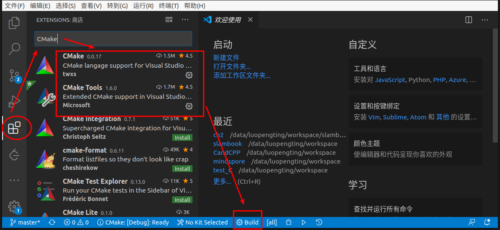
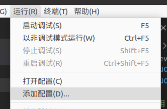

# SLAM十四讲

## 初识SLAM

### 2.4 编程基础

#### 2.4.5 使用IDE

我使用的是VSCode，于是便尝试了VSCode进行编译运行。

1. 安装CMake工具  
安装完之后看下界面下方有没有出现`Build`。

2. 添加运行配置  


    将launch.json里面的`"program": "enter program name, for example ${workspaceFolder}/a.out"`修改为CMakeLists里面的可执行文件。如示例中的可执行语句为：

    ```C++
    # 将库文件链接到可执行程序上
    target_link_libraries( useHello hello_shared )
    ```

    即将这个配置修改为：`"program": "${workspaceFolder}/build/useHello"`
3. 编译运行  
    点击第一步看到的`Build`进行编译，按F5即可执行。
    也可以打断点，再按F5进行调试。
